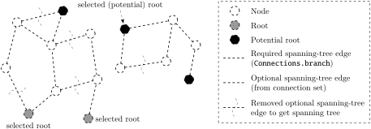
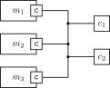
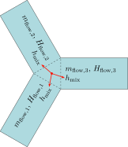

# Graphics for the Modelica language specification

## Purpose

This repository contains files needed to generate some of the graphics used in the [specification of the Modelica language](https://github.com/modelica/ModelicaSpecification).  The graphics are defined using the [Shapes language](http://lang-shapes.sourceforge.net/), and the sources are not committed to the https://github.com/modelica/ModelicaSpecification repository to reflect the still experimental status of the Shapes language.

## Contents

These are the graphics provided by this repository (SVG shown inline, with links to PDF variant and source code).

In addition, unrelated to the figures of the Modelica specification, this repository is also [home to some examples](https://henrikt-ma.github.io/ModelicaSpecificationGraphics/SVG_Bitmap/) of different ways an SVG image can be used in a Modelica icon or diagram, served as GitHub pages.

### Different kinds of discrete-time variables

 [PDF](products/piecewise-constant.pdf) [source](source/piecewise-constant.shape)

 [PDF](products/clock.pdf) [source](source/clock.shape)

 [PDF](products/clocked.pdf) [source](source/clocked.shape)

### Interface or Type Relationships

 [PDF](products/subtype.pdf) [source](source/subtype.shape)

### Connectors

 [PDF](products/innerouterconnector.pdf) [source](source/innerouterconnector.shape)

 [PDF](products/overdetermined.pdf) [source](source/overdetermined.shape)

 [PDF](products/fluidsystem.pdf) [source](source/fluidsystem.shape)

 [PDF](products/fluidmix.pdf) [source](source/fluidmix.shape)

 [PDF](products/fluidmix3.pdf) [source](source/fluidmix3.shape)

 [PDF](products/fluidmix4.pdf) [source](source/fluidmix4.shape)

### Packages

 [PDF](products/modelicapath.pdf) [source](source/modelicapath.shape)

### Synchronous

 [PDF](products/plantmodel.pdf) [source](source/plantmodel.shape)

### State Machines

 [PDF](products/statemachine.pdf) [source](source/statemachine.shape)

 [PDF](products/hierarchical-statemachine.pdf) [source](source/hierarchical-statemachine.shape)

 [PDF](products/statemachineplot.pdf) [source](source/statemachineplot.shape)

### Annotations for Graphical Objects

 [PDF](products/bezierpoints.pdf) [source](source/bezierpoints.shape)

For the graphics with gradient fills below, beware of bugs in SVG and PDF viewers.
PNG images are provided for reference.

 [PNG](converted/cylinder-gradient.png) [PDF](converted/cylinder-gradient.pdf) [source](source/cylinder-gradient.shape)

 [PNG](converted/sphere-gradient.png) [PDF](converted/sphere-gradient.pdf) [source](source/cylinder-gradient.shape)

 [PNG](converted/sphere-gradient-triangle.png) [PDF](converted/sphere-gradient-triangle.pdf) [source](source/cylinder-gradient.shape)
